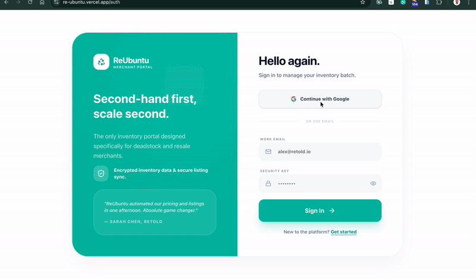

<!-- PROJECT BANNER -->
<div align="center">

# 🏷️ Muna Deadstock Intake & Listing Portal

### *Empowering Clothing Retailers in the Secondary Market*

[](https://nextjs.org/)
[](https://supabase.com)
[](https://www.typescriptlang.org/)
[](https://tailwindcss.com/)

<br/>

**A full-stack web application for clothing retailers to bulk upload deadstock inventory, auto-price items using dynamic multipliers, and list them to distribution partners.**

[🚀 Quick Start](#-quick-start) • [📤 Upload Guide](#-how-to-upload-csv) • [💰 Pricing Logic](#-pricing-logic) • [🧪 Tests](#-running-tests)

</div>

---

## 📸 Sneak Peek

<!-- Add your screenshot/GIF here -->


---

## ✨ Features

- **🔐 Secure Authentication** — Email/password login with Supabase Auth
- **📁 Bulk CSV Upload** — Drag-and-drop inventory uploads with real-time progress
- **✅ Smart Validation** — Row-by-row validation with clear, actionable error messages
- **💰 Dynamic Pricing** — Automatic resale price calculation based on condition & category
- **📊 Inventory Dashboard** — Filter, search, and manage items with bulk actions
- **🚀 Listing Workflow** — Select items and list to distribution partners in one click
- **⚡ Real-time Updates** — Live processing status via Supabase Realtime

---

## 🚀 Quick Start

### Prerequisites

| Tool | Version | Purpose |
|------|---------|---------|
| Node.js | 24+ | JavaScript runtime |
| pnpm | Latest | Package manager |
| Supabase CLI | v1.0+ | Local backend development |
| Docker | Latest | Supabase local services |

### 🔑 Login Options

You can sign in using either:
- **Google SSO** - Quick and secure login with your Google account
- **Email & Password** - Use your credentials and check your email for confirmation

---

## 📋 Setup Instructions

### 1. Clone & Install

```bash
# Clone the repository
git clone https://github.com/odhiambo-ed/ReUbuntu.git
cd ReUbuntu

# Install frontend dependencies
cd frontend
pnpm install
```

### 2. Backend Setup

```bash
# Navigate to backend
cd backend/supabase

# Start Supabase local services
supabase start

# Apply migrations (runs automatically, or reset with):
supabase db reset
```

> 📖 For detailed backend setup, see **[Backend README](./backend/supabase/README.md)**

### 3. Environment Configuration

```bash
# In frontend directory
cp .env.example .env.local
```

Update `.env.local`:

```env
NEXT_PUBLIC_SUPABASE_URL=http://127.0.0.1:54321
NEXT_PUBLIC_SUPABASE_ANON_KEY=<your-local-anon-key>
```

### 4. Launch Application

```bash
cd frontend
pnpm dev
```

🌐 Open **[http://localhost:3000](http://localhost:3000)**

---

## 📤 How to Upload CSV

### Step-by-Step Guide

1. **Login** → Use test credentials above
2. **Navigate** → Click **"Upload Inventory"** in sidebar
3. **Select File** → Drag & drop or click **"Browse Files"**
4. **Process** → Click **"Upload & Process"**
5. **Review** → View success/error summary with details
6. **Explore** → Click **"View Inventory"** to see imported items

### 📄 CSV Format Specification

| Column | Required | Valid Values | Example |
|--------|:--------:|--------------|---------|
| `merchant_id` | ✅ | Non-empty string | `MERCHANT001` |
| `sku` | ✅ | Unique per merchant | `SKU-12345` |
| `title` | ✅ | Product name | `Blue Denim Jacket` |
| `brand` | ❌ | Brand name | `Levi's` |
| `category` | ✅ | See categories below | `Jackets` |
| `condition` | ✅ | `new`, `like_new`, `good`, `fair` | `good` |
| `original_price` | ✅ | Positive number | `899.00` |
| `currency` | ✅ | Currency code | `ZAR` |
| `quantity` | ✅ | Positive integer (default: 1) | `5` |

**Valid Categories:** `Tops`, `Bottoms`, `Outerwear`, `Jackets`, `Dresses`, `Knitwear`, `Shoes`, `Accessories`, `Activewear`

### Sample CSV

```csv
merchant_id,sku,title,brand,category,condition,original_price,currency,quantity
MERCHANT001,SKU-001,Blue Denim Jacket,Levi's,Jackets,good,899.00,ZAR,1
MERCHANT001,SKU-002,White Cotton T-Shirt,H&M,Tops,new,199.00,ZAR,3
MERCHANT001,SKU-003,Black Running Shoes,Nike,Shoes,like_new,1299.00,ZAR,1
```

---

## 💰 Pricing Logic

Resale prices are **automatically calculated** using database triggers:

```
resale_price = original_price × condition_multiplier × category_multiplier
```

### Condition Multipliers

| Condition | Multiplier | Description |
|-----------|:----------:|-------------|
| `new` | 0.70 | Brand new with tags |
| `like_new` | 0.60 | Like new, minimal wear |
| `good` | 0.50 | Good condition |
| `fair` | 0.35 | Fair, visible wear |

### Category Multipliers

| Category | Multiplier | | Category | Multiplier |
|----------|:----------:|-|----------|:----------:|
| Outerwear | 1.10 | | Knitwear | 0.90 |
| Jackets | 1.05 | | Bottoms | 0.85 |
| Dresses | 1.00 | | Tops | 0.80 |
| Shoes | 0.95 | | Accessories | 0.75 |

### 📊 Example Calculation

```
Item:        Blue Denim Jacket
Price:       R899.00
Condition:   good (×0.50)
Category:    Jackets (×1.05)
─────────────────────────────
Resale:      R899 × 0.50 × 1.05 = R471.98
```

---

## 🧪 Running Tests

### Frontend Tests

```bash
cd frontend
npm test                 # Run all tests
npm test -- --coverage   # With coverage report
npm test -- --watch      # Watch mode
```

### Backend Tests

```bash
cd backend/supabase/functions/process-csv-upload
deno test --allow-read   # Run Edge Function tests
```

### Test Coverage

| Area | Tests | Coverage |
|------|:-----:|----------|
| **CSV Validation** | ✅ | Required fields, value validation, format checks |
| **Pricing Logic** | ✅ | Multiplier calculations, rounding, edge cases |
| **Upload Hooks** | ✅ | API calls, state management, error handling |
| **Inventory Actions** | ✅ | Bulk operations, status updates |

---

## 📁 Project Structure

```
muna-deadstock-portal/
├── 📂 frontend/                    # Next.js 14 Application
│   ├── app/                        # App Router pages
│   │   ├── auth/                   # Login/Register
│   │   └── dashboard/              # Protected routes
│   ├── components/                 # Reusable UI components
│   ├── features/                   # Feature modules
│   │   ├── inventory/              # Inventory management
│   │   ├── uploads/                # CSV upload logic
│   │   └── pricing/                # Pricing utilities
│   ├── lib/                        # Supabase client, utils
│   └── __tests__/                  # Jest test suites
│
├── 📂 backend/
│   └── supabase/
│       ├── functions/              # Edge Functions
│       │   └── process-csv-upload/ # CSV processor
│       └── migrations/             # Database schema
│
├── 📂 prds/                        # Technical documentation
└── 📂 sample-data/                 # Sample CSV files
```

> 📖 **[Frontend README](./frontend/README.md)** | **[Backend README](./backend/supabase/README.md)**

---

## 📝 Key Assumptions & Tradeoffs

### Assumptions

| Assumption | Implication |
|------------|-------------|
| **Single Currency (ZAR)** | Currency stored but not converted; multi-currency is future enhancement |
| **SKU Unique per Merchant** | Same SKU allowed for different merchants; constraint on (user_id, merchant_id, sku) |
| **Listing = Status Change** | "Listing" simulated as internal status update, not external API call |
| **Browser Support** | Modern browsers only (Chrome, Firefox, Safari, Edge - latest 2 versions) |

### Technical Tradeoffs

| Decision | Tradeoff | Reasoning |
|----------|----------|-----------|
| **Async Edge Function Processing** | More complex than sync | Non-blocking UX; handles large files without timeout |
| **Strict Category Validation** | No custom categories | Ensures consistent pricing; category management can be added |
| **Database-Level Price Triggers** | Logic in DB | Single source of truth; auto-recalculates on updates |
| **Partial Success Processing** | More complex UI | One bad row shouldn't block 999 good ones |

---

## 🔒 Security

- ✅ **Row Level Security (RLS)** on all tables
- ✅ **User data isolation** by `user_id`
- ✅ **Supabase Auth** for authentication
- ✅ **File validation** for type (CSV only) and size (5MB limit)
- ✅ **Middleware protection** on all API routes

---

## 🛠️ Tech Stack

| Layer | Technology |
|-------|------------|
| **Frontend** | Next.js 14, React 18, TypeScript |
| **Styling** | Tailwind CSS, shadcn/ui, Lucide Icons |
| **Backend** | Supabase (PostgreSQL, Auth, Storage) |
| **Edge Functions** | Deno, Supabase Edge Functions |
| **Validation** | Zod (client & server) |
| **Testing** | Jest, React Testing Library, Deno Test |

---

## 👨‍💻 Author

<a href="https://github.com/odhiambo-ed" target="blank">
  
</a>

**Edward Odhiambo**

[](https://github.com/odhiambo-ed)
[](https://x.com/odhiambo_ed)
[](https://www.linkedin.com/in/edward-odhiambo/)
[](https://edwardodhiambo.space/)

---

## 🤝 Contributing

Contributions, issues, and feature requests are welcome!

Feel free to check the [issues page](https://github.com/odhiambo-ed/muna-deadstock-portal/issues)

---

## ⭐ Show Your Support

Give a ⭐️ if you like this project!

---

## 📝 License

This project is [MIT](./LICENSE) licensed.

---

<div align="center">

**Built with ❤️ for Muna Deadstock Assessment**

*January 2026*

</div>
